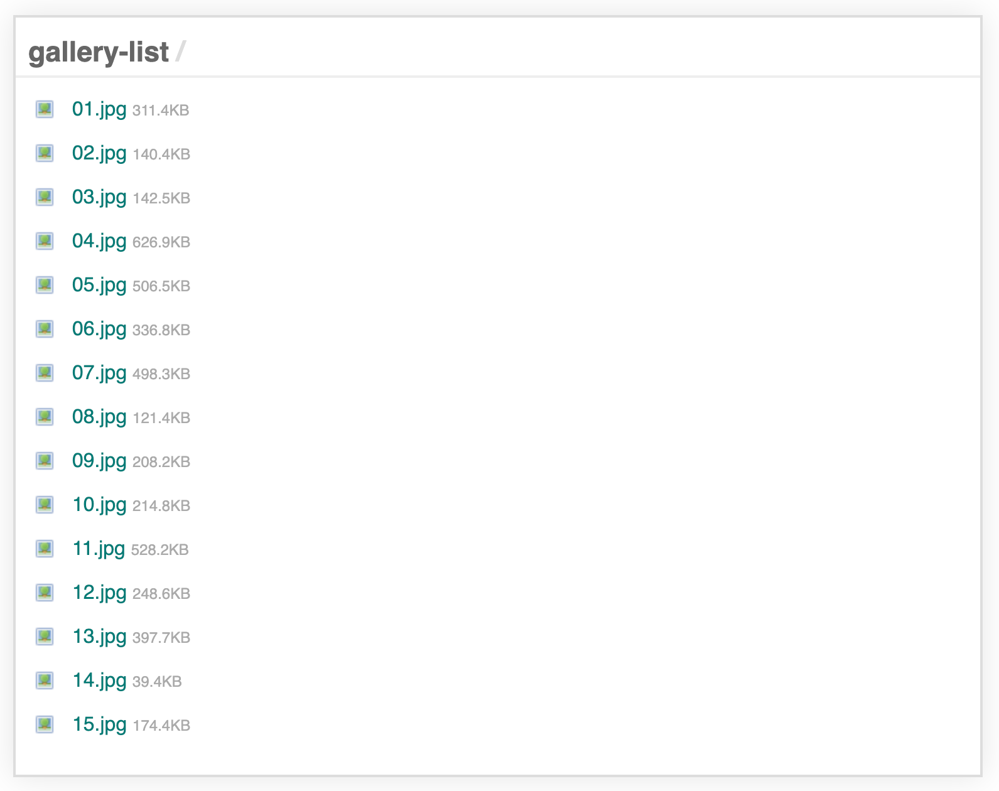

## Photo Gallery
A simple all-in-one php photo gallery script intended to be simply dropped into a directory of photos. It displays a list of the files in the directory, and when clicked, opens them in a lightbox with slideshow functionality (users can use the arrow keys or icons to switch between images in the folder). Designed to be a replacement for my photo gallery script for when the number of files is large enough that showing previews of each file onload is too cumbersome or resource-intensive.

150 lines of clean, well-commented php/html/css/js. Enjoy!



*****

### Quick Install (cli)
To quickly install the script from the command line, navigate to the directory you'd like to install this script to (inside a folder of photos), and execute the following command.

```
curl -O https://raw.githubusercontent.com/jpederson/photo-gallery-list/master/index.php
```

*****

Developed with love by [James Pederson](https://jpederson.com).